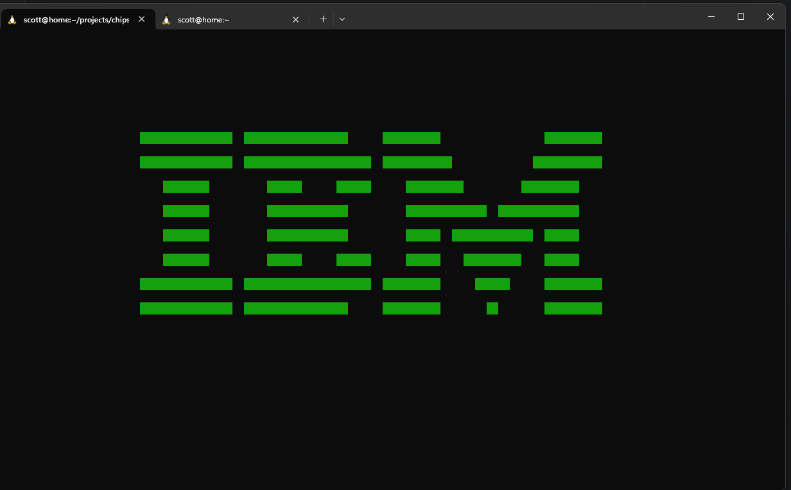

# Chip8 Emulator (Symfony Console Command)


This is a simple **Chip8 emulator** built as a **Symfony Console Command**.  
It runs entirely inside your terminal — please make sure your terminal window is at least **128x32** characters in size for proper display.

---

## Installation

1. Clone the repository:

```bash
git clone git@github.com:scottdriscoll/chip8.git
cd chip8
```

2. Install dependencies:

```bash
composer install
```

3. (Optional) Ensure your terminal is large enough: minimum **128x32** characters.

---

## Usage

Run the emulator using Symfony's console:

```bash
php bin/console app:chip8 [path] [debug-output-path] [--max-cycles=N]
```

### Arguments

| Argument | Type    | Default                        | Description |
|:---------|:--------|:-------------------------------|:------------|
| `path`   | optional | `tests/fixtures/roms/ibm_logo.ch8` | Path to a Chip8 ROM file. If omitted, a built-in IBM logo ROM is used. |
| `debug-output-path` | optional | — | If provided, debug information will be written to this file during execution. |

### Options

| Option        | Shortcut | Type    | Description |
|:--------------|:---------|:--------|:------------|
| `--max-cycles` | `-m`      | optional | Halt the emulator after executing the given number of instructions. |

---

### Keyboard

The original keypad supported only hexadecimal characters, so 0-9,a-f. The keys are normally laid out in a grid as such:

```text
123C
456D
789E
A0BF
```

This would be extremely annoying to use on a QWERTY keyboard, so instead we map the following keys to the above:

```text
1234
QWER
ASDF
ZXCV
```

So 'Q' will map to '4', 'W' to '5', and so on. I have not tested on non-qwerty layouts.

---

## Finding ROMs

You are responsible for providing your own Chip8 ROM files.  
Many public domain or homebrew Chip8 programs are available freely online.

Example usage with a custom ROM:

```bash
php bin/console app:chip8 my-roms/pong.ch8
```

Example usage with debug output and max cycles:

```bash
php bin/console app:chip8 my-roms/pong.ch8 debug.txt --max-cycles=10000
```
Running the emulator with the default parameters should display the following output:



---

## Notes

- **Terminal Size**: Ensure at least **128x32** characters for correct display.
- **Performance**: This emulator is intended for educational and light usage. It may not run ROMs at exact real-time speed.
- **Debugging**: The debug output is mainly intended for developers exploring the emulator's internals.

---

## Commands not yet implemented
- **Sound**: Everything involving sound, (f002, fx3a). If I get around to this, I'll probably just make a visual flash in place of actual audio.

---

## Compatibility

Tested and works normally in a native linux terminal.

Also tested and working in WSL2 for windows, however there are random 2-3 second freezes that I haven't figured out yet.

Update: Updating to latest WSL2 fixes freezes.

---

## License

This project is provided as-is for educational purposes.  
Please respect the licenses of any ROMs you download and use.
